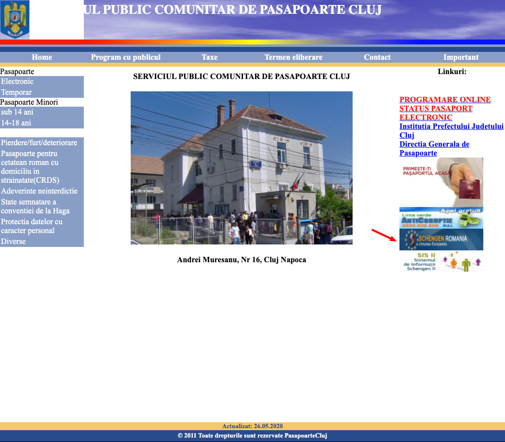

# Bugs-TestCases

**Summary**   
Link Schengen Romania European Union not found.  
 
**Description**  
Any user should be able to access "Schengen Romania European Union".  
The bug is produced by redirecting on a page with 404 Not Found Error.   
 
**Steps to Reproduce**   
1. Open www.pasapoartecluj.ro   
2. Click on the image "Schengen Romania European Union" on the right side.   
 
**Actual results** 
When you click on the image "Schengen Romania European Union" you are redirecting on a page with 404 Not Found Error.  
 
**Expected results**  
All users should be able to access "Schengen Romania European Union" should be redirected to the Schengen Romania European Union official page.  

**Summary**   
Anyone on the site can give more than one rating to a book.   

**Description**   
As a user can give more than one rating for a book without the need to have the book acquired or to have a user from the same IP address.   

**Steps to reproduce**       
1. Open https://www.librariaonline.ro      
2. Click on a random book   
3. Click on how many stars do you want to give for the book how many times do you want    

**Actual results**   
Give seven stars five times one after another without the need to buy this book or to be logged.   
  
**Expected results**   
As a user to be able to give a rating only for a verified acquisition, one time with a verified user.  
  
  
