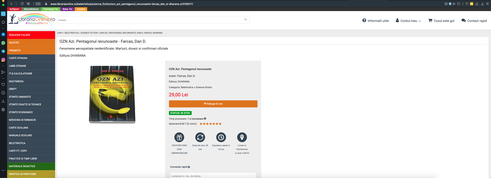
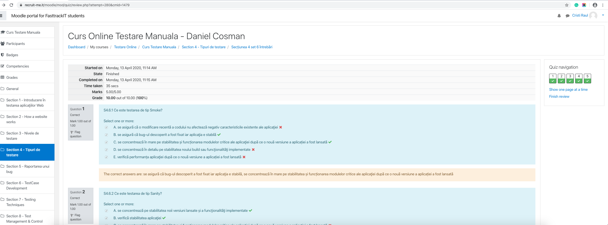

# Bug Reports

**Summary**   
Link Schengen Romania European Union not found.  
 
**Description**  
Any user should be able to access "Schengen Romania European Union".  
The bug is produced by redirecting on a page with 404 Not Found Error.   
 
**Steps to Reproduce**   
1. Open www.pasapoartecluj.ro   
2. Click on the image "Schengen Romania European Union" on the right side.   
 
**Actual results** 
When you click on the image "Schengen Romania European Union" you are redirecting on a page with 404 Not Found Error.  
 
**Expected results**  
All users should be able to access "Schengen Romania European Union" should be redirected to the Schengen Romania European Union official page.  

--------------------------------------------------------------------------------------------------------------------------------------------------------------------

**Summary**   
Anyone on the site can give more than one rating to a book.   

**Description**   
As a user can give more than one rating for a book without the need to have the book acquired or to have a user from the same IP address.   

**Steps to reproduce**       
1. Open https://www.librariaonline.ro      
2. Click on a random book   
3. Click on how many stars do you want to give for the book how many times do you want    

**Actual results**   
Give seven stars five times one after another without the need to buy this book or to be logged.   
  
**Expected results**   
As a user to be able to give a rating only for a verified acquisition, one time with a verified user.  
   

-------------------------------------------------------------------------------------------------------------------------------------------------------------------

**Summary**   
After a chapter for an online curs is a quiz section, where the user can test his new knowledge. Every question has multiple correct answers.   

**Description**  
As a user should receive the maximum score test only if he selects only the correct answers.      

**Steps to reproduce**   
 1. Open www.recruite-me.it/moodle/login/index.php   
 2. Enter a valid user and a valid password and click on "Log in"   
 3. Click on "Curs Online Testare Manuala"   
 4. Click on "Section 4 - Tipuri de testare"   
 5. Click on "Sectiunea 4 set 6 intrebari"   
 6. Click on "Attempt quiz now"   
 7. Select all answer options and click "Next page"   
 8. Select all answer options and click "Next page"   
 9. Select all answer options and click "Next page"   
10. Select all answer options and click "Next page"   
11. Select all answer options and click "Finish attempt..."   
12. Click on "Submit all and finish"   
13. Click on the "Submit all and finish" in the new "Confirmation" window   

**Actual Results**   
Pass the test and receive the maximum score.    

**Expected Results**   
Fail the test because were selected the correct and incorrect answers.   

-------------------------------------------------------------------------------------------------------------------------------------------------------------------

# Test Cases

**Title**  
Jmeter HTTP Request on mogultechblog.wordpress.com   

**Summary**   
Getting average load time for website homepage.   
 
**Steps to reproduce**   
1. Execute Jmeter   
2. Click in the menu bar "Edit" -> "Add" -> "Threads (Users)" -> "Thread Group"   
3. Click in the field "Number of Threads (users)" and type 5   
4. Click the field "Ramp-up period (seconds)" and type 2   
5. Click the field "Loop Count" and type 3   
6. Right click on "Thread Group" - > "Add" -> "Sampler" -> "HTTP Request"   
7. Copy link "mogultechblog.wordpress.com" in "Server Name or IP" field   
8. Right click on "HTTP Request" -> "Add" -> "Listener" -> "View Results Tree"    
9. Click in the menu bar on "Run" -> "Start   

------------------------------------------------------------------------------------------------------------------------------------------------------------------- 

**Title**  
Check weather using city id   
 
**Summary**   
Search for a city weather information on "https://openweathermap.org" using id to find a city.   

**Steps to reproduce**   
1. Open Postman   
2. Click "New" - >  click "Request" - >   enter a name "Request name" field  , select in which collection do you want to save it  and click "Save"   
3. In the "Enter request URL" field enter"api.openweathermap.org/data/2.5/weather?appid=X2238cb90033a9951525d7daa113340c&units=metric&id=681290"   
4. Click "Send"   

------------------------------------------------------------------------------------------------------------------------------------------------------------------- 

**Title**    
Information about corona virus cases in USA      

**Summary**   
Receive information's regarding Coronavirus in US  cases by County.   
In our test from California.   
 
**Steps to reproduce**   
1. Open Postman   
2. Click "New" - >  click "Request" - >   enter a name "Request name" field  , select in which collection do you want to save it  and click "Save"   
3. In the "Enter request URL" field enter "http://coronavirusapi.com/getTimeSeries/CA"   
4. Click "Send"   

-------------------------------------------------------------------------------------------------------------------------------------------------------------------

